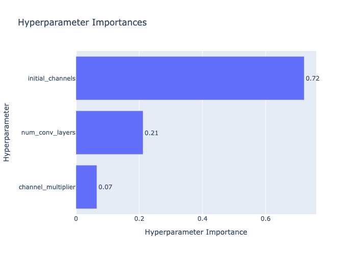

# SYDE 577 Assignment 2

## Sat, Oct 18:
training params:
- NUM_EPOCHS = 5
- BATCH_SIZE = 64
- LEARNING_RATE = 0.001

model params:
- num_conv_layers=3,
- initial_channels=8,
- channel_multiplier=2.0,
- num_classes=10

Got test accuracy of 98.84% after 5 epochs. 

From here we can hypertune:
1. Model params
2. Training params
3. Optimizer choice
4. Data augmentation techniques

## Mon, Oct 27: 
Got best accuracy of 99.33% accuracy using 30 optuna trials for study defined in [architecture_tuning.py](architecture_tuning.py). This found the optimal architecture to be: 
- num_conv_layers: 4 
- initial_channels: 32
- channel_multiplier: 2.0

Hyperparameter importance determined by Optuna showed that the initial number of channels is by far the most important architecture planner.

